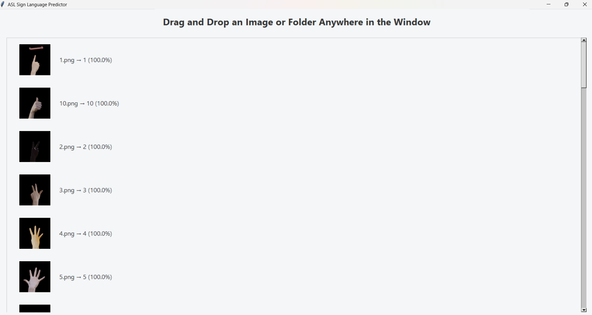
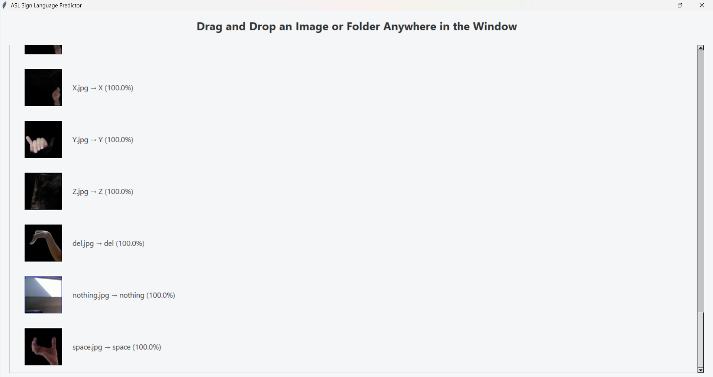
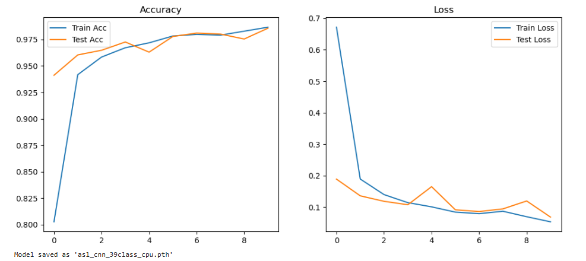

# 🤟 ASL Hand Gesture Recognition

[](LICENSE)
[](https://www.python.org/)
[](https://pytorch.org/)
[](https://opencv.org/)
[](https://wiki.python.org/moin/TkInter)


An end-to-end deep learning project for real-time American Sign Language (ASL) hand gesture recognition. Includes image preprocessing, CNN training, evaluation metrics, and a drag-and-drop GUI for interactive predictions.

---

## 🔍 Features

- 🎯 High Accuracy CNN classifier for 39 ASL gestures (A–Z, 0–10, space, nothing, del)
- 🛠️ Image Preprocessing: Background removal, resizing, normalization
- 📊 Model Training & Evaluation: Accuracy plots, confusion matrix
- 🖼️ Interactive GUI: Drag & drop single images or entire folders
- 💾 Model Persistence: Save and reload trained PyTorch models

---

## 📦 Project Structure

```
├── Model_Make.ipynb           # Notebook for training the CNN model  
├── GUI.ipynb                  # Notebook for launching drag-and-drop GUI  
├── preprocess.py              # Script to clean, resize, and structure dataset  
├── requirements.txt           # List of dependencies  
├── asl_cnn_39class_cpu.pth    # Saved trained model (PyTorch)  
├── Preprocessed_data/         # Folder with preprocessed images per class  
├── test/                      # Folder with one test image per class  
├── gui1.png                   # GUI screenshot 1  
├── gui2.png                   # GUI screenshot 2  
├── model1.png                 # Confusion matrix  
├── model2.png                 # Accuracy/loss plots  
└── README.md                  # Project documentation  
```

---

## 🧠 Model Overview

- **Input Shape:** 32x32 RGB  
- **Architecture:** Custom CNN with 3 conv blocks + dropout + batch norm  
- **Classes:** 39 total  
- **Final Test Accuracy:** ✅ **98.57%**

> Model trained on CPU with over 42,000 images across all classes.

---

## 📁 Dataset

This project combines multiple datasets:

- **ASL Alphabet** – Hand signs A–Z  
  📎 https://www.kaggle.com/datasets/grassknoted/asl-alphabet

- **ASL Numbers** – Synthetic hand signs 0–10  
  📎 https://www.kaggle.com/datasets/lexset/synthetic-asl-numbers

---

## 🧪 Tech Stack

| Component         | Tools                            |
|------------------|----------------------------------|
| Model Training    | PyTorch, NumPy, OpenCV           |
| GUI               | Tkinter, TkinterDnD2, Pillow     |
| Data Processing   | Pandas, Matplotlib, Seaborn      |
| Evaluation        | Scikit-learn, Confusion Matrix   |

---

## 🚀 Getting Started

### 1️⃣ Clone the Repository

```bash
git clone https://github.com/your-username/asl-gesture-recognition.git
cd asl-gesture-recognition
```

### 2️⃣ Install Dependencies

```bash
pip install -r requirements.txt
```

### 3️⃣ Preprocess the Dataset

```bash
python preprocess.py
```

### 4️⃣ Train the CNN

```bash
jupyter notebook Model_Make.ipynb
```

Run all cells to train and save the model as `asl_cnn_39class_cpu.pth`.

### 5️⃣ Launch the GUI

```bash
jupyter notebook GUI.ipynb
```

Then drag and drop:
- A **single image** to get prediction and confidence
- A **folder** to get batch predictions

---

## 🧾 Requirements

### Core Libraries
numpy==1.26.4  
pandas==2.2.2  
opencv-python==4.9.0.80  
matplotlib==3.8.4  
seaborn==0.13.2  
scikit-learn==1.5.0  

### PyTorch (CPU Version)
torch==2.3.0  
torchvision==0.18.0  

### GUI & Drag-and-Drop
tkinterdnd2==0.3.0  
Pillow==10.3.0  

> ⚠️ Note: `tkinter` is part of the Python standard library but may need to be installed manually:  
> `sudo apt install python3-tk` (Linux) or use your Python distribution (e.g., Anaconda).

---

## 📊 Results Snapshot

Final Accuracy: 98.57%  
Epochs Trained: 10  
Total Images: 42,000+ across 39 classes

---

## 🖼️ GUI Preview

| GUI Sample 1 | GUI Sample 2 |
|--------------|--------------|
|  |  |

---

## 📊 Model Training Visuals

### 📌 Confusion Matrix


### 📈 Accuracy and Loss (Train/Test)


---

## 📄 License

This project is licensed under the **MIT License**.  
See the [LICENSE](LICENSE) file for details.

---

## 🙌 Acknowledgments

- [ASL Alphabet Dataset – Kaggle](https://www.kaggle.com/datasets/grassknoted/asl-alphabet)  
- [ASL Numbers Dataset – Kaggle](https://www.kaggle.com/datasets/lexset/synthetic-asl-numbers)  
- [TkinterDnD2 by pmgagne](https://sourceforge.net/projects/tkinterdnd/)
